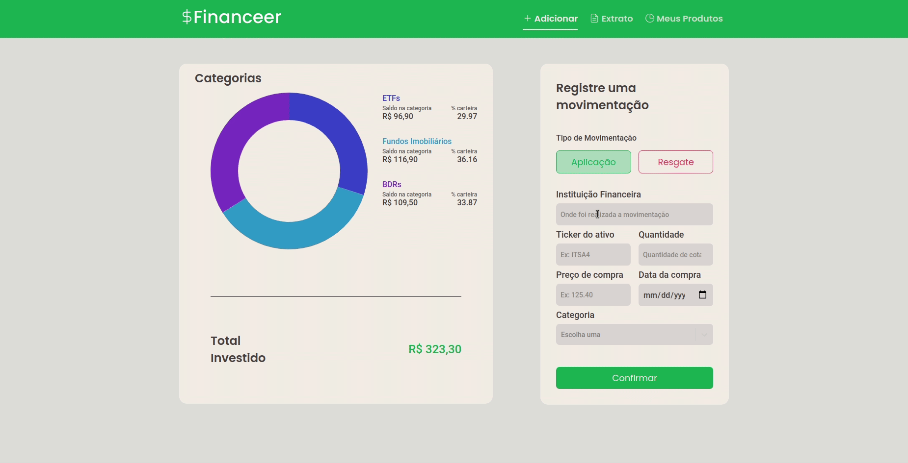
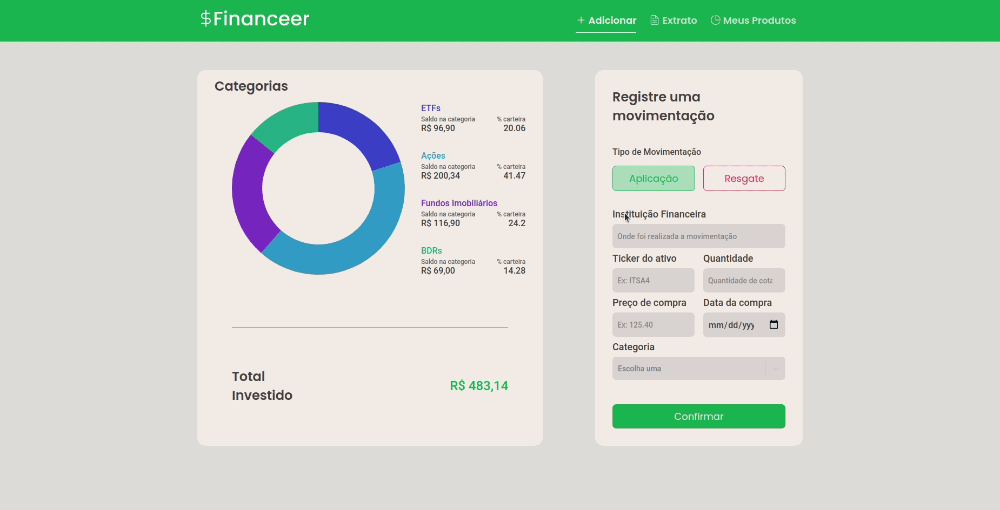

<h1 align="center">
    
</h1>

  <a href="#question-about">About</a>&nbsp;&nbsp;&nbsp;|&nbsp;&nbsp;&nbsp;
  <a href="#gear-technologies">Technologies</a>&nbsp;&nbsp;&nbsp;|&nbsp;&nbsp;&nbsp;
  <a href="#getting-started">Getting Started</a>&nbsp;&nbsp;&nbsp;|&nbsp;&nbsp;&nbsp;
  <a href="#memo-license">License</a>

 

## Movement Registration:

    

## Balance Details:

---

  

## :question: About

An app to consolidate your investments on the stock exchange. 

I developed this app to fix knowledge and learn new things like MySQL, Docker and charts in ReactJS. I also made a Figma template.

<a href="https://www.figma.com/file/dKtXzM663UyWlqjPt7sMLo/Financeer?node-id=0%3A1"> **Financeer** template here</a> 

## :gear: Technologies

**These are the technologies that I used to develop this application:**

⌨️ <strong>Typescript</strong> —> Extends JavaScript by adding types;  
⚙️ <strong>NodeJS</strong> —> A platform for building network applications; 
🌐 <strong>Express</strong> —> Web framework for Node.js 
📚 <strong>Typeorm</strong> —> Used to manage databases; 
📚 <strong>MySQL</strong> —> Used to store movements and categories; 
⚛️ <strong>ReactJS</strong> —> A JavaScript library for building user interfaces; 
💅 <strong>Styled-components</strong> —> Tagged template literals to style the components; 
📊 <strong>Chart.js</strong> —> Used to create charts; 
📊 <strong>React-chartjs-2</strong> —> Used to create charts; 
✅ <strong>Unform</strong> —> Used to create forms; 
🌐 <strong>Axios</strong> —> Promise based HTTP client for the browser and Node JS; 

 

# Getting Started

## :rocket: Getting started with Docker
1. Install docker: https://docs.docker.com/get-docker/
2. Install docker-compose: https://docs.docker.com/compose/install/
3. Clone this repo: `git clone https://github.com/erickivel/Financeer.git`
4. Move to the directory: `cd Financeer`
5. Run `docker-compose up` to builds, creates, starts and attaches the containers
6. To view the web application, go to: http://localhost:3000
7. The server runs on: http://localhost:3333

To stop and removes the containers, run `docker-compose down` 

Note: If `docker-compose up` or `docker-compose down` doesn't work run respectively `sudo docker-compose up` or `sudo docker-compose down`

## :rocket: Getting started without Docker
1. Clone this repo: `git clone https://github.com/erickivel/Financeer.git`
2. Move to the directory: `cd Financeer`

### Server
1. Move to the server directory: `cd server`
2. Run `yarn` or `npm install` to install the dependencies
3. Run `yarn dev:server` or `npm run dev:server` to start the server
4. The server runs on http://localhost:3333

### Web
1. Move to the web directory: `cd web`
2. Run `yarn` or `npm install` to install the dependencies
3. Run `yarn start` or `npm run start` to start the web application
4. The web application runs on http://localhost:3000

## :memo: License

This project is licensed under the **MIT License** - see the [LICENSE](LICENSE) file for details.
